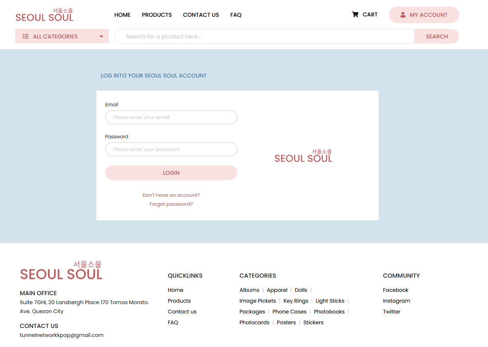
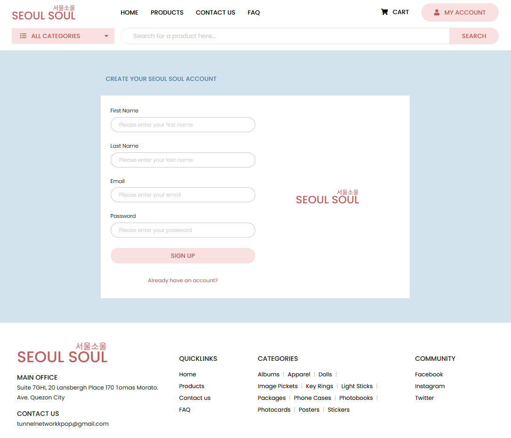
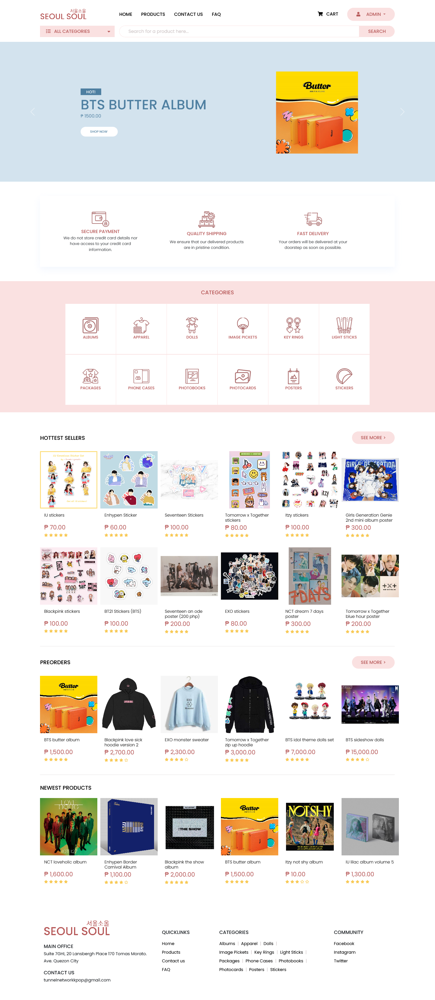
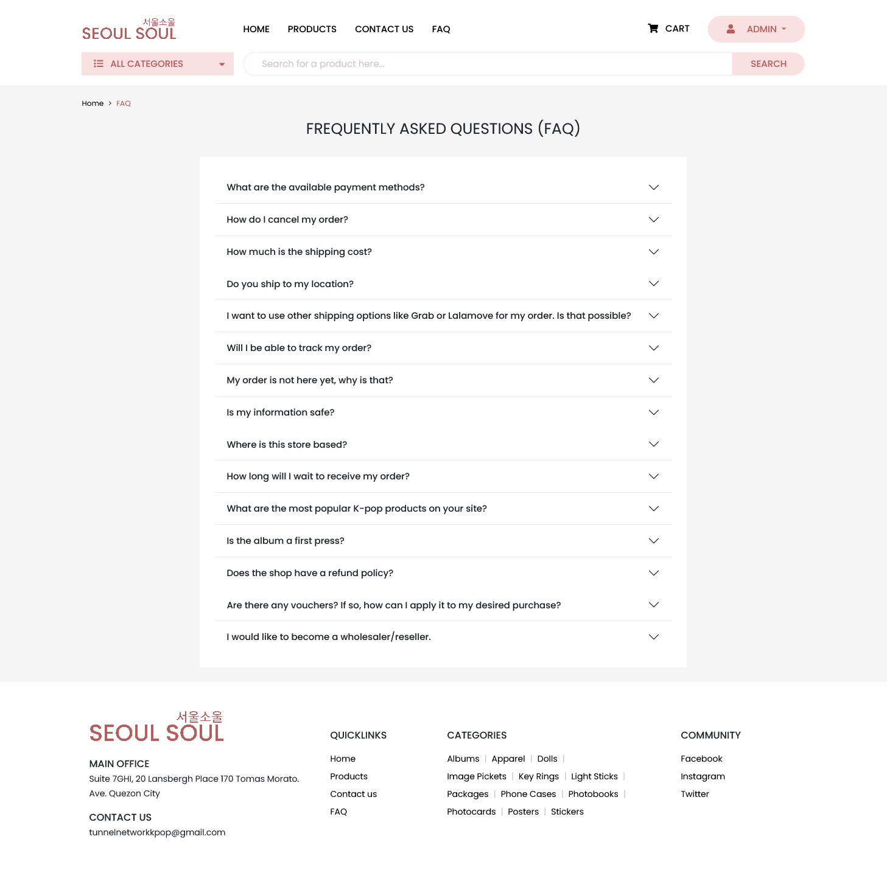
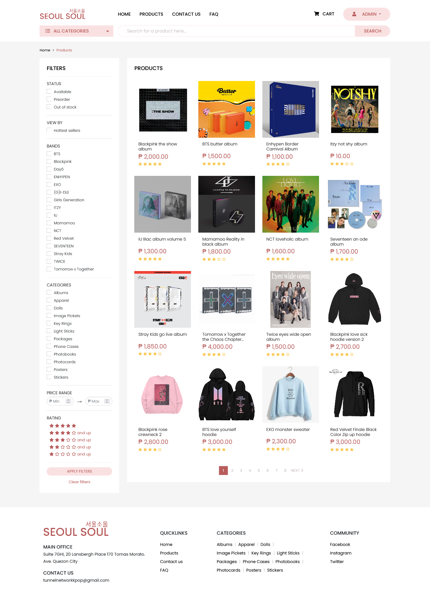
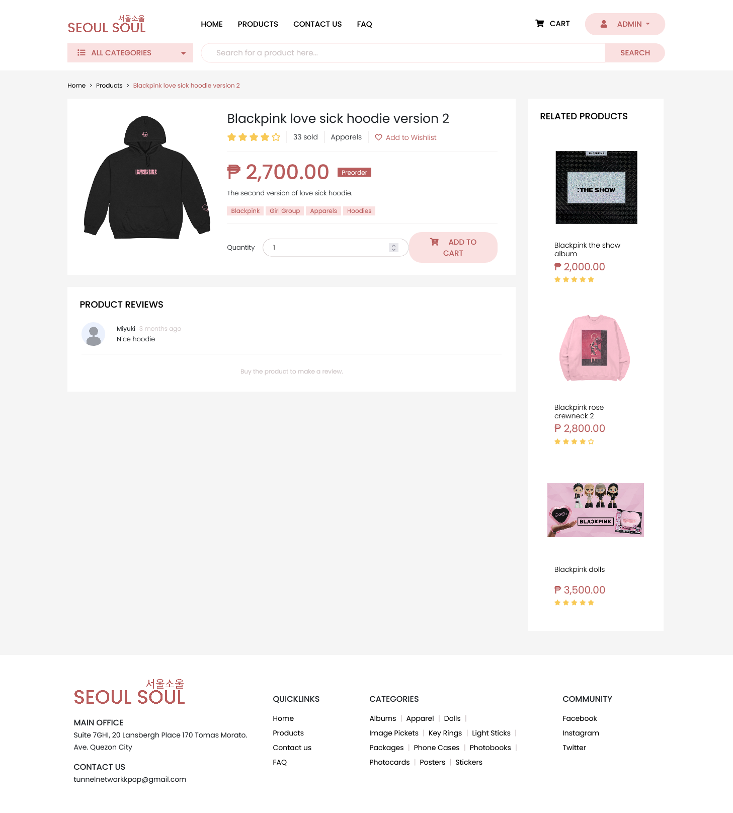
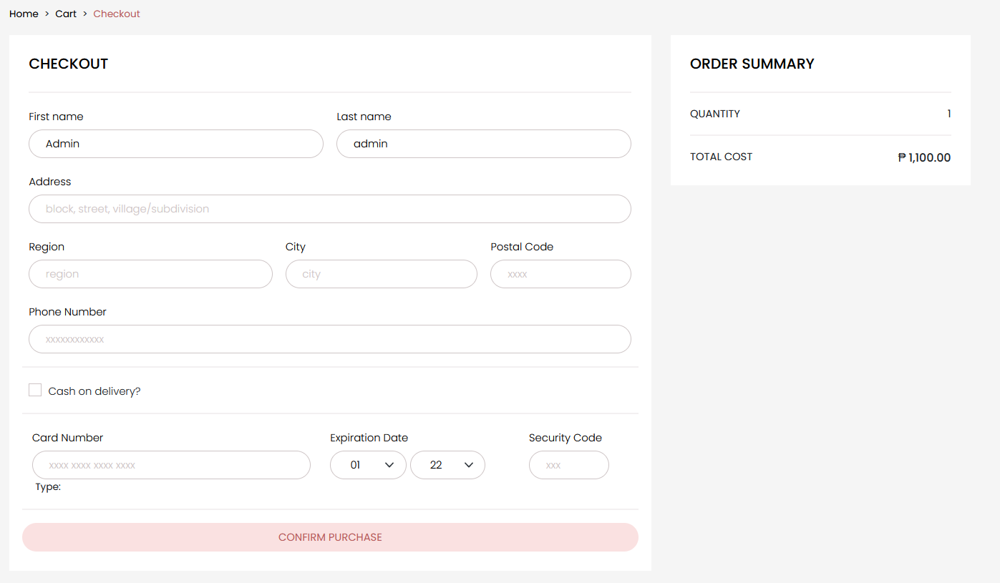
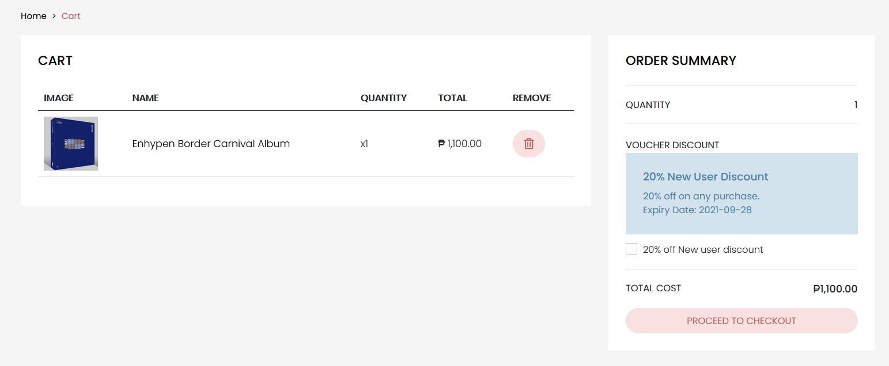
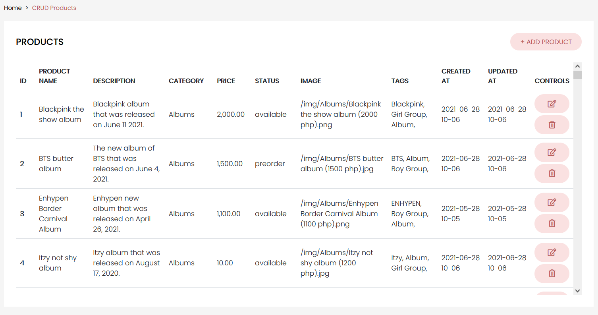

# KpOnlineStore

## Description

An online kpop merchandise store for a course in CIIT College of Arts and Technology

### Instructor

- [Calen Legaspi](https://github.com/calen-legaspi)

### Group Members

- [Nadji Tan](https://github.com/Kapatid) (Kapatid) - Backend/Fronted
- [Jeremy Habal](https://github.com/J-Habal) (J-Habal) - Frontend
- [Gabriel Verceles](https://github.com/Koruuin) (Koruuin) - Data & Documentation
- [Jerwin Fabelico](https://github.com/Omni-ssiah) (Omni-ssiah) - Data & Documentation

### Sample Images

